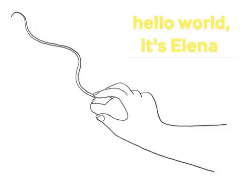

# **Hi there, 👋**

**Thanks for stopping by!**

## **👩🏼‍💻 About me:**

My name is Elena and I'm living in Seville, a beautiful city in the south of Spain. In a former life I was a marketeer, 📊 but now I'm a rookie front-end developer. I love sports, 🏀 writing ✍🏻 and lenguages. 💬

  
 
 

## **🙃 What's more:**

**📚** I’m currently learning:

   

**🤓** And I'm keen to learn many more things ...

## **📫 You can reach me:**

- [Email](mailto:elena.valenzuela.guerrero@gmail.com)
- [LinkedIn](https://www.linkedin.com/in/elena-valenzuela-guerrero/)
- [Twitter](https://twitter.com/elevalgue)
